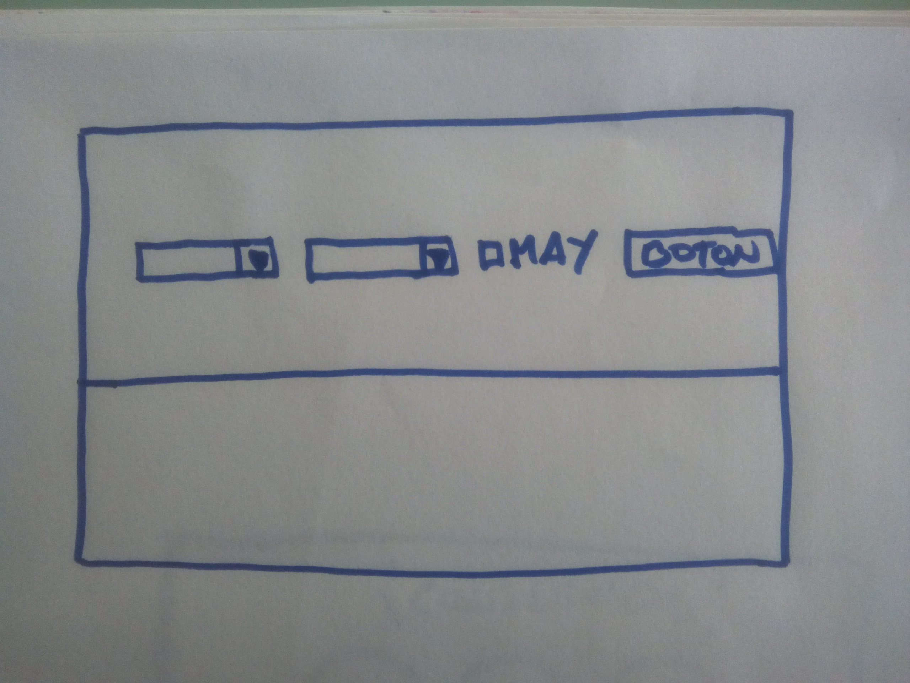
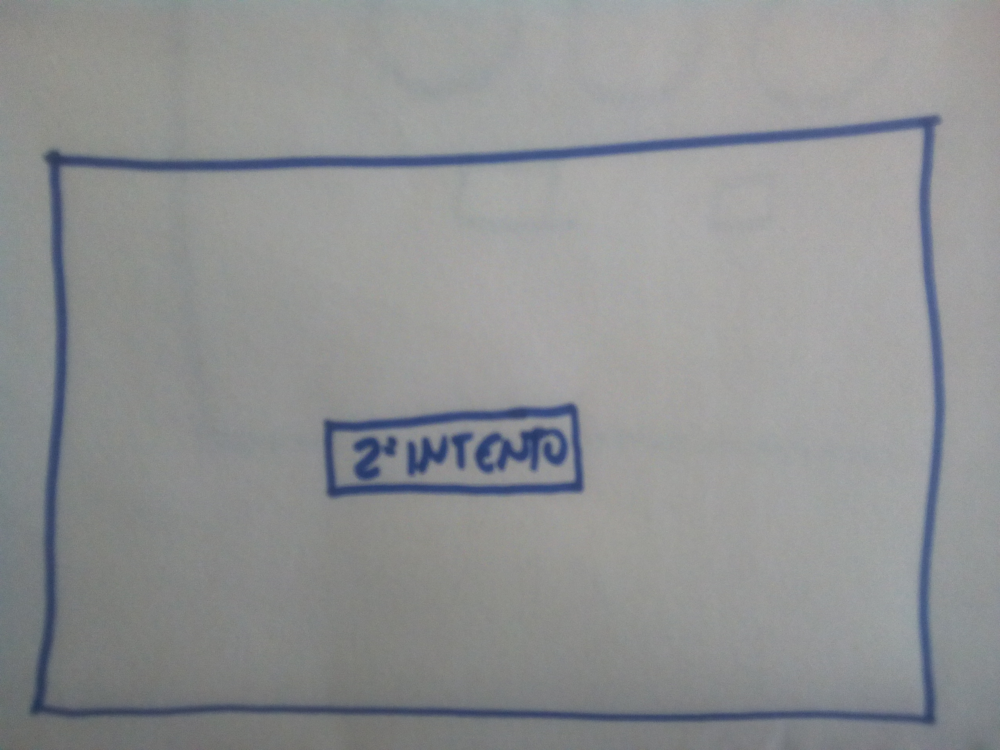
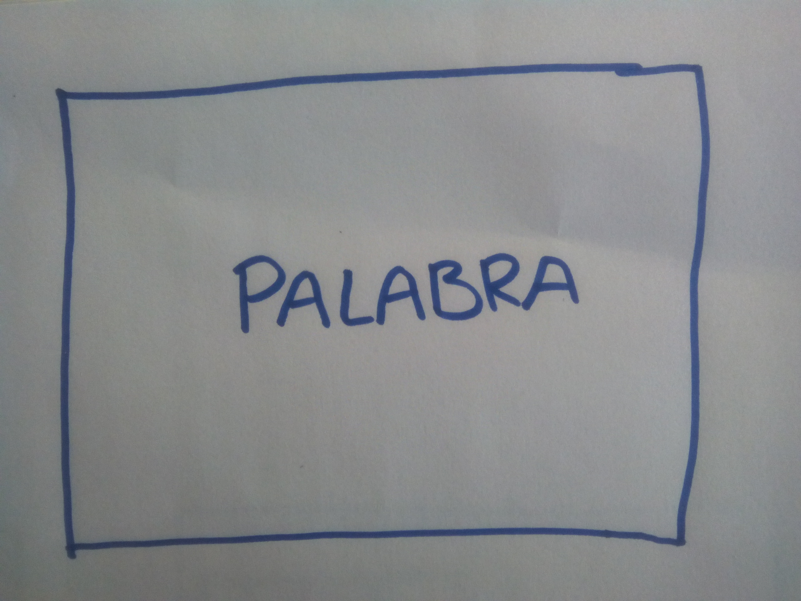
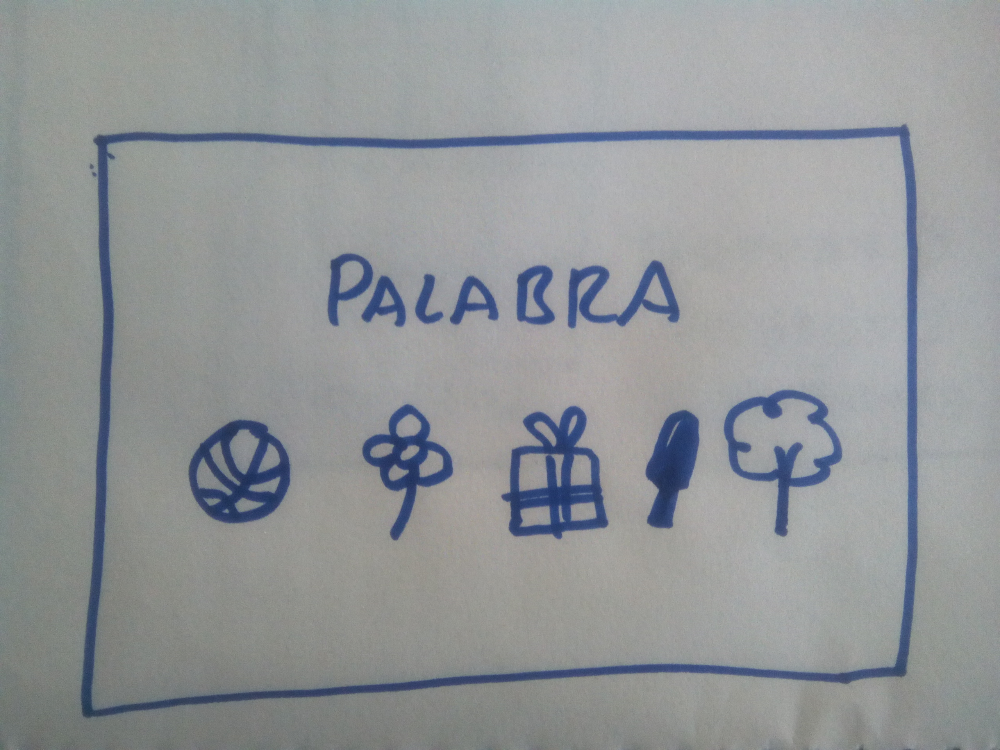
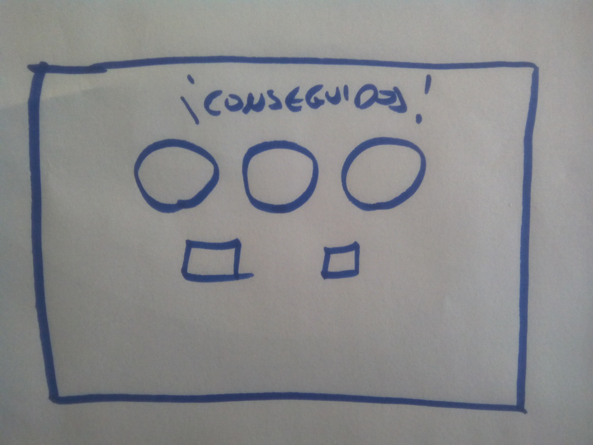
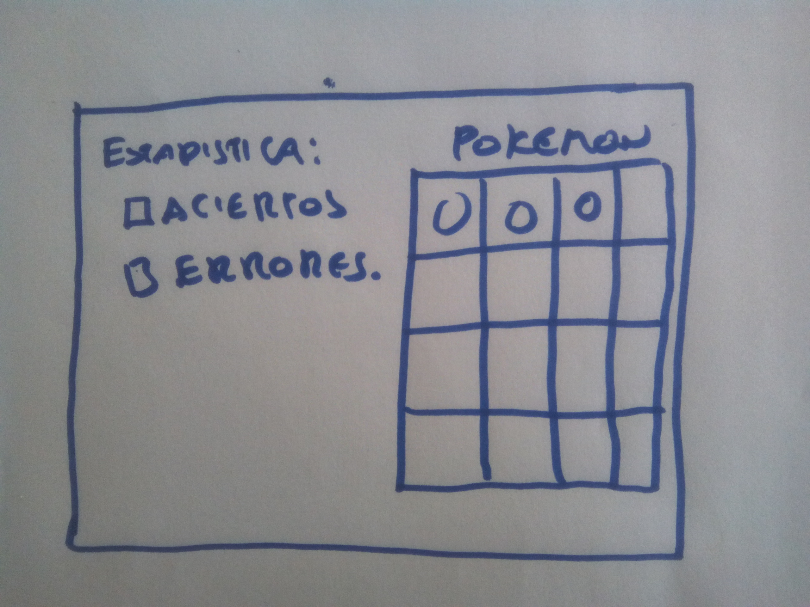

# APLICACIÓN WEB PARA APRENDER A LEER

El proyecto consistirá en la creación de una aplicación para enseñar a leer a niños/as realizando una adaptación alternativa a el "Método Doman".

## CONTEXTO

### `EN QUÉ CONSISTE EL METODO DOMAN`

    Básicamente este método se basa en mostrar al niño series de cinto tarjetas con palabras, escritas con letras grandes y que correspondan a una misma categoría para que el niño vaya estableciendo relaciones. Después, poco a poco se van añadiendo categorías.

    Así, las categorías pueden ser: colores, animales, juguetes, vocabulario del cuerpo, familia, etc.
    
### `FASES DEL MÉTODO DOMAN`

 El aprendizaje en este método se da en diferentes fases:

    **Primera fase:** palabras. En esta fase se muestran palabras solas. Sustantivos organizados donde el primer día se pasarán cinco palabras de una categoría. El segundo día cinco palabras de la misma categoría, más cinco palabras más. El tercer día se pasarán las diez palabras de la primera categoría y segunda categoría, más cinco palabras más. El cuarto día se pasarán las quince palabras de la primera, segunda y tercera categoría más cinco palabras más. Al quinto día se pasarán las veinte palabras de la primera, segunda, tercera, y cuarta categoría y cinco palabras más. Nunca se ha de pasar de 25 tarjetas por días. Así, a partir del quinto día podremos sustituir una categoría antigua por otra nueva. Las categorías se pasan por separado y nunca mezcladas.

    **Segunda fase:** parejas de palabras. En esta fase se forman pares de palabras. Se volverán a utilizar las palabras de la primera fase con juegos de parejas de palabras como por ejemplo: ojos verdes, manzanas rojas. Juegos de contrario como por ejemplo: grande - pequeño. O palabras compuestas: zumo naranja.

    **Tercera fase:** oraciones sencillas. Se introducen verbos en la oración de tal manera que ahora habrá nombre + verbo + acción. Por ejemplo: papá está durmiendo

    **Cuarta fase:** frases. Es el momento donde se incluyen los artículos para ir formando frases completas.

    **Quinta fase:** cuentos. Es hora de elegir el cuento idóneo para leer. De entre 50 y 10 palabras y con una sola frase por página. No se trata de un método rígido, sino flexible donde se admiten modificaciones. Se trata de adaptar el método siempre a las necesidades de cada niño.

### `ADAPTACIÓN PARA LA APLICACIÓN`

    **Para el desarrollo de la aplicación tan solo tendremos en cuenta la primera fase del método en la que solo se muestran series de 5 palabras.**, el resto de fases se dejarán para nuevas versiones de la aplicación.  

    En nuestra versíon inicial el usuario a través de un formulario inicial seleccionará:

    * Una categoría
    * Los segundos de transición que habrá entre palabra y palabra
    * Un checkbox para poder seleccionar si quiere mostrar las palabras en mayúsculas o en su defecto en minúscula.

    Tras esta página inicial la aplicación mostrará una serie de cinco palabras que irán pasando una por una, manteniendose en pantalla el tiempo estipulado en el formulario, tiempo que el usuario tendrá para nombrarla en voz alta para que el niño/a la memorice antes de que se muestre la siguiente. Terminada la secuencia de cinco palabras se mostrará un botón para volver a comenzar con la siguiente repetición aleatoria de esas mismas palabras pasadas con anterioridad. El proceso se repetirá un total de tres veces en las cuales el niño/a tendrá la oportunidad de visualizar las mismas palabras, a la vez que las escucha, para memorizarlas.

    Una vez realizadas las tres repeticiones la pantalla muestra una de las palabras y debajo de esta cinco imagenes que representan las cinco imagenes de la serie. El usuario deberá seleccionar la imagen correcta que representa la palabra mostradá. Una vez realizada la seleccion se pasará a proceder del mismo modo con la siguiente palabra de la serie. Las palabras acertadas pasarán a contabilizar como acertadas y a cambio el usuario consequirá una imagen de un pokemon los cuales se iran almacenando para poder visualizar las capturas. Las palabras no acertadas pasarán a un mazo de palabras que volverán a repetirse en la siguiente sesión.

## REQUERIMIENTOS

    ### PARTE VISUAL

    En cuanto al diseño, ubicación de los elementos, colores, imágenes y elementos decorativos está totalmente abierto a la creatividad e imaginación del desarrollador, las capturas que incluyo **son solo orientativas para representar los requerimientos básicos que han de contener algunas de las ventanas.** 
    Podrán añadirse o reducir el número de ventanas que se quiera pero como mínimo deben cumplir con los requisitos descritos en negrita

        #### `Primera Ventana`

        La ventana de inicio debe contener como mínimo un formulario en el cual el usuario indique como mínimo:
        
        **1. Una categoria de las que se les presente a traves de un select como pueden ser:**

        * Animales.  
        * Frutas.  
        * Etc. 

       ** 2. Un tiempo, en segundos, que marcará el tiempo que permanecerá cada palabra en pantalla antes de pasar a la siguiente:**

        * Un segundo.
        * Dos segundos.
        * Etc. 

        Tambien podría presentarse como niveles de dificultad en vez de segundos a elegir.

       ** 3. Un checkbox para marcar o desmarcar para elegir la opción de que las palabras se muestren en mayúsculas o mínisculas.**

       ** 4. Un botón de inicio para recoger los datos del formulario e iniciar con el juego.**

        Imagen orientativa:

        

        #### `Segunda Ventana`

       ** El juego se desarrolla en tres series, cada serie contiene 5 palabras asi que al comienzo y al finalizar cada serie deberá aparecer un botón que accione la siguiente serie.**

        
       
        #### `Tercera Ventana`

        En esta ventana si **se requiere que la pantalla sea blanca, para evitar cualquier otra distracción del niño, en la cual tan solo se presentará una palabra con un tamaño superior al h1 y que ocupe toda la parte central de la pantalla**. Transcurridos los segundos seleccionados en la pantalla de inicio habrá una transición o efecto fade in y fade out para la palabra que entra y la que sale.
       ** La fuente utilizada debe ser una fuente lo más parecida a la escolar tradicional** ya que hay letras que en pc se grafían de forma diferente a la que utilizamos para la escritura a mano como las efes, ges, a, ....

        
        
        #### `Cuarta Ventana`

        Terminadas las tres sesiones se debe mostrar una de las cinco palabras y debajo de esta cinco imagenes que correspondan con todas las imagenes que ilustran el significado de cada palabra de la serie. El usuario podrá pulsar sobre ellas pero **solo tendrá una oportunidad para acertar.** Tras su elección **se le indicará si ha acertado o nó pero no se le mostrará el resultado correcto.** A la vez que acierta se le podría mostrar el pokemon que ha conseguido. Esta acción se repetira hasta terminar con las cinco palabras.

        

        #### `Quinta Ventana`

        Tras terminar aparecerán las imagenes de los pokemons conseguidos en esta serie y tres botones:

        1. Para visualizar la totalidad de todos los pokemons y estadisticas de aciertos y fallos.
        2. Para continuar con la serie.
        3. Para volver a la página de inicio

        

        #### `Sexta Ventana`

        Esta ventana es la encargada de mostrar las estadisticas de errores y aciertos y una relación con todos los pokemon conseguidos, contendrá dos botones:

        1. Para continuar con la serie.
        1. Para volver a la página de inicio

        
        

    ### PARTE LÓGICA
        #### `Continuará....` 